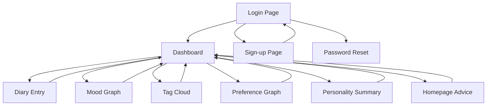

## 1. Product Overview

memU is a secure personal portfolio website that combines diary writing with AI-powered personality analysis. Users write diary entries, and memU's layered memory architecture analyzes moods, preferences, and personality traits to provide personalized insights and advice.

The product solves the problem of self-reflection and personal growth tracking by automatically extracting meaningful patterns from daily entries, helping users understand their emotional trends, preferences, and personality development over time.

## 2. Core Features

### 2.1 User Roles

| Role | Registration Method | Core Permissions |
|------|---------------------|------------------|
| User | Email registration with username/password | Write diaries, view personal analytics, receive advice |

### 2.2 Feature Module

Our memU requirements consist of the following main pages:
1. **Login page**: User authentication with username/password
2. **Sign-up page**: New user registration
3. **Password reset page**: Account recovery functionality
4. **Diary entry page**: Write entries with date selection, mood extraction, and preference detection
5. **Dashboard**: Overview with mood history graph, tag cloud, and preference summaries
6. **Mood graph page**: Detailed mood trend visualization
7. **Tag cloud page**: Visual representation of frequently used tags
8. **Preference graph page**: Charts showing likes, dislikes, interests, and avoidances
9. **Personality summary page**: Long-term personality traits from memU layers
10. **Homepage advice**: Personalized recommendations based on recent entries and trends

### 2.3 Page Details

| Page Name | Module Name | Feature description |
|-----------|-------------|---------------------|
| Login page | Authentication form | Enter username and password to access personal data |
| Sign-up page | Registration form | Create new account with username, email, and password |
| Password reset page | Recovery form | Reset forgotten password via email |
| Diary entry page | Entry form | Write diary text, select date, save entry with automatic analysis |
| Diary entry page | Mood extraction | Automatically infer mood from text content |
| Diary entry page | Tag generation | Create emotion and event tags from diary content |
| Diary entry page | Preference detection | Identify likes, dislikes, interests, and avoidances |
| Diary entry page | Personality update | Update memU layered personality model |
| Dashboard | Mood history graph | Display mood trends over time with line chart |
| Dashboard | Tag cloud | Show frequently used tags in visual cloud format |
| Dashboard | Preference summary | List top likes, dislikes, interests, and avoidances |
| Mood graph page | Detailed visualization | Interactive mood trend analysis with filters |
| Tag cloud page | Tag analytics | Frequency analysis and category breakdown |
| Preference graph page | Preference charts | Bar/pie/radar charts for positive vs negative categories |
| Personality summary page | Trait display | Show 10 core personality dimensions with scores |
| Homepage advice | Daily recommendations | Generate personalized advice based on recent mood and trends |
| Homepage advice | Weekly guidance | Provide longer-term suggestions based on personality |

## 3. Core Process

### User Flow:
1. New users register via sign-up page with username, email, and password
2. Existing users login to access their personal dashboard
3. Users write diary entries on the diary entry page with automatic analysis
4. memU engine processes entries to extract moods, tags, preferences, and update personality layers
5. Users view their analytics on dashboard and dedicated graph pages
6. System generates personalized advice based on accumulated data

## 4. User Interface Design

### 4.1 Design Style
- **Primary colors**: Deep purple (#6B46C1) for main elements, soft lavender (#E9D5FF) for accents
- **Secondary colors**: Warm gray (#6B7280) for text, white (#FFFFFF) for backgrounds
- **Button style**: Rounded corners with subtle shadows, primary actions in purple
- **Font**: Clean sans-serif (Inter or similar), 16px base size with clear hierarchy
- **Layout style**: Card-based design with generous white space, top navigation bar
- **Icons**: Minimal line icons with consistent stroke width, emoji support for mood indicators

### 4.2 Page Design Overview

| Page Name | Module Name | UI Elements |
|-----------|-------------|-------------|
| Login page | Authentication form | Centered card with input fields, purple gradient background, subtle animations |
| Diary entry page | Entry form | Large text area with date picker, mood indicator chips, real-time tag suggestions |
| Dashboard | Mood history graph | Interactive line chart with color-coded mood states, zoom controls |
| Dashboard | Tag cloud | Dynamic word cloud with size-based frequency, clickable tags |
| Preference graph page | Preference charts | Color-coded bar charts distinguishing positive/negative categories |
| Personality summary page | Trait display | Radar chart for personality dimensions, progress bars for trait scores |
| Homepage advice | Recommendations | Card-based layout with category icons, gentle color scheme |

### 4.3 Responsiveness
Desktop-first design approach with mobile adaptation. Touch interaction optimization for graph interactions and diary writing on mobile devices.

### 4.4 Data Visualization
- Mood graphs use smooth line charts with gradient fills
- Tag clouds implement physics-based layout algorithms
- Preference graphs use distinct colors for positive (green) vs negative (red) categories
- Personality radar charts show 10 dimensions with normalized scores