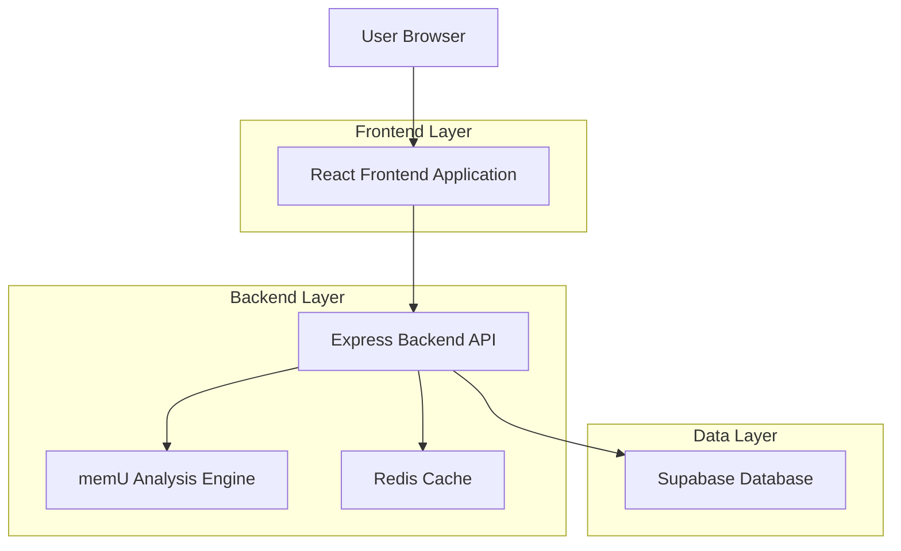
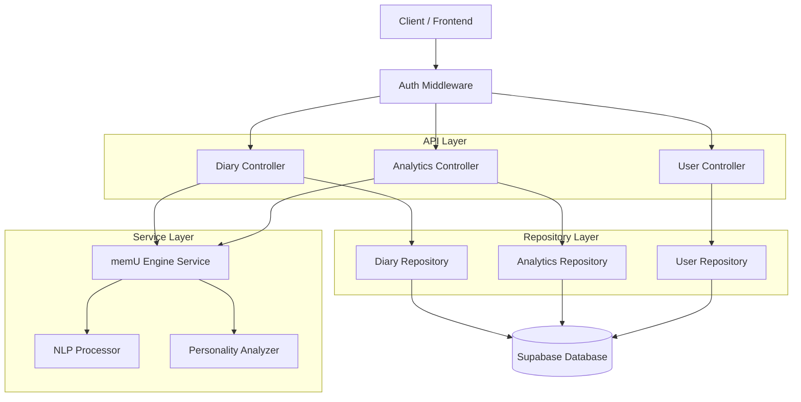
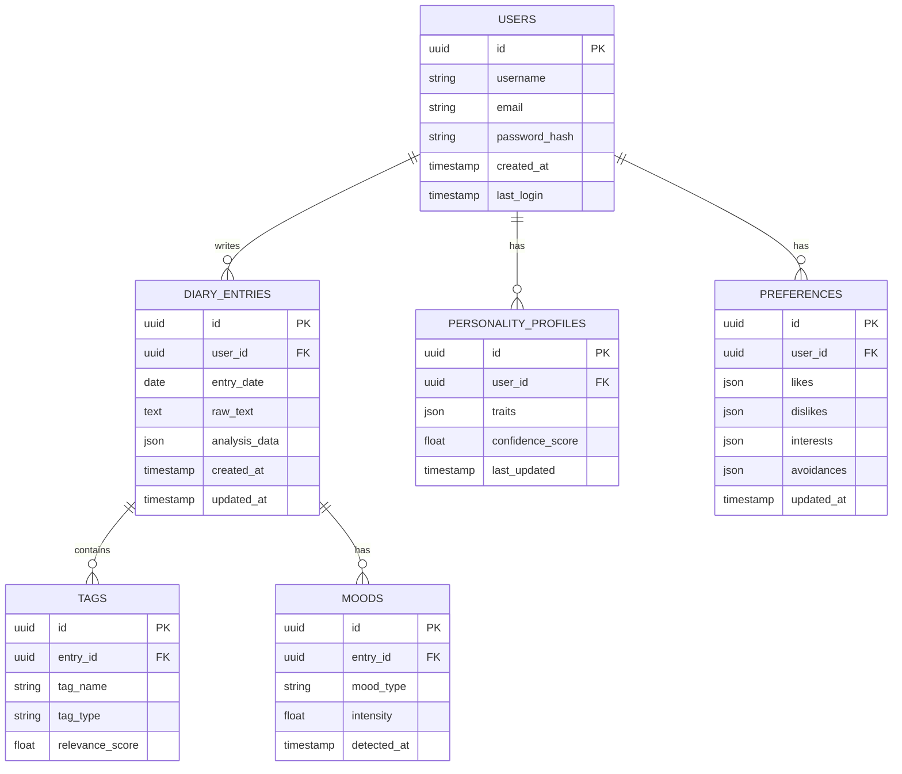

## 1. Architecture design



## 2. Technology Description

- Frontend: React@18 + tailwindcss@3 + vite
- Initialization Tool: vite-init
- Backend: Express@4 + Node.js
- Database: Supabase (PostgreSQL)
- Cache: Redis
- Authentication: Supabase Auth
- Chart Library: Chart.js + react-chartjs-2
- Text Analysis: Natural@1.6 (NLP library)

## 3. Route definitions

| Route | Purpose |
|-------|---------|
| /login | User authentication page |
| /signup | New user registration |
| /reset-password | Password recovery |
| /dashboard | Main dashboard with overview |
| /diary/new | Create new diary entry |
| /diary/:id | View specific diary entry |
| /analytics/mood | Detailed mood graph |
| /analytics/tags | Tag cloud visualization |
| /analytics/preferences | Preference charts |
| /personality | Personality summary |
| /advice | Personalized recommendations |
| /profile | User settings and profile |

## 4. API definitions

### 4.1 Authentication APIs

**User Registration**
```
POST /api/auth/register
```

Request:
| Param Name | Param Type | isRequired | Description |
|------------|------------|------------|-------------|
| username | string | true | Unique username |
| email | string | true | User email address |
| password | string | true | Password (min 8 chars) |

Response:
| Param Name | Param Type | Description |
|------------|------------|-------------|
| success | boolean | Registration status |
| user_id | string | New user ID |

**User Login**
```
POST /api/auth/login
```

Request:
| Param Name | Param Type | isRequired | Description |
|------------|------------|------------|-------------|
| username | string | true | Username or email |
| password | string | true | User password |

Response:
| Param Name | Param Type | Description |
|------------|------------|-------------|
| token | string | JWT access token |
| user | object | User profile data |

### 4.2 Diary APIs

**Create Diary Entry**
```
POST /api/diary/entries
```

Request:
| Param Name | Param Type | isRequired | Description |
|------------|------------|------------|-------------|
| date | string | true | Entry date (YYYY-MM-DD) |
| raw_text | string | true | Diary content |
| mood | string | false | Inferred mood |
| tags | array | false | Extracted tags |

Response:
| Param Name | Param Type | Description |
|------------|------------|-------------|
| entry_id | string | Created entry ID |
| analysis | object | memU analysis results |

**Get Diary Entries**
```
GET /api/diary/entries?start_date=&end_date=
```

Response:
| Param Name | Param Type | Description |
|------------|------------|-------------|
| entries | array | List of diary entries |
| total_count | number | Total entry count |

### 4.3 Analytics APIs

**Get Mood History**
```
GET /api/analytics/mood-history
```

Response:
| Param Name | Param Type | Description |
|------------|------------|-------------|
| mood_data | array | Array of {date, mood, score} |
| trends | object | Mood trend analysis |

**Get Personality Profile**
```
GET /api/analytics/personality
```

Response:
| Param Name | Param Type | Description |
|------------|------------|-------------|
| traits | object | 10 personality dimensions |
| confidence | number | Analysis confidence score |
| last_updated | string | Last update timestamp |

## 5. Server architecture diagram



## 6. Data model

### 6.1 Data model definition



### 6.2 Data Definition Language

**Users Table**
```sql
-- create table
CREATE TABLE users (
    id UUID PRIMARY KEY DEFAULT gen_random_uuid(),
    username VARCHAR(50) UNIQUE NOT NULL,
    email VARCHAR(255) UNIQUE NOT NULL,
    password_hash VARCHAR(255) NOT NULL,
    created_at TIMESTAMP WITH TIME ZONE DEFAULT NOW(),
    last_login TIMESTAMP WITH TIME ZONE,
    is_active BOOLEAN DEFAULT true
);

-- create indexes
CREATE INDEX idx_users_username ON users(username);
CREATE INDEX idx_users_email ON users(email);
```

**Diary Entries Table**
```sql
-- create table
CREATE TABLE diary_entries (
    id UUID PRIMARY KEY DEFAULT gen_random_uuid(),
    user_id UUID REFERENCES users(id) ON DELETE CASCADE,
    entry_date DATE NOT NULL,
    raw_text TEXT NOT NULL,
    analysis_data JSONB,
    created_at TIMESTAMP WITH TIME ZONE DEFAULT NOW(),
    updated_at TIMESTAMP WITH TIME ZONE DEFAULT NOW()
);

-- create indexes
CREATE INDEX idx_diary_user_id ON diary_entries(user_id);
CREATE INDEX idx_diary_entry_date ON diary_entries(entry_date);
CREATE INDEX idx_diary_created_at ON diary_entries(created_at DESC);
```

**Personality Profiles Table**
```sql
-- create table
CREATE TABLE personality_profiles (
    id UUID PRIMARY KEY DEFAULT gen_random_uuid(),
    user_id UUID REFERENCES users(id) ON DELETE CASCADE,
    traits JSONB NOT NULL,
    confidence_score FLOAT DEFAULT 0.0,
    last_updated TIMESTAMP WITH TIME ZONE DEFAULT NOW()
);

-- create indexes
CREATE INDEX idx_personality_user_id ON personality_profiles(user_id);
```

**Preferences Table**
```sql
-- create table
CREATE TABLE preferences (
    id UUID PRIMARY KEY DEFAULT gen_random_uuid(),
    user_id UUID REFERENCES users(id) ON DELETE CASCADE,
    likes JSONB DEFAULT '[]',
    dislikes JSONB DEFAULT '[]',
    interests JSONB DEFAULT '[]',
    avoidances JSONB DEFAULT '[]',
    updated_at TIMESTAMP WITH TIME ZONE DEFAULT NOW()
);

-- create indexes
CREATE INDEX idx_preferences_user_id ON preferences(user_id);
```

**Tags Table**
```sql
-- create table
CREATE TABLE tags (
    id UUID PRIMARY KEY DEFAULT gen_random_uuid(),
    entry_id UUID REFERENCES diary_entries(id) ON DELETE CASCADE,
    tag_name VARCHAR(100) NOT NULL,
    tag_type VARCHAR(50) NOT NULL,
    relevance_score FLOAT DEFAULT 1.0,
    created_at TIMESTAMP WITH TIME ZONE DEFAULT NOW()
);

-- create indexes
CREATE INDEX idx_tags_entry_id ON tags(entry_id);
CREATE INDEX idx_tags_name ON tags(tag_name);
CREATE INDEX idx_tags_type ON tags(tag_type);
```

**Moods Table**
```sql
-- create table
CREATE TABLE moods (
    id UUID PRIMARY KEY DEFAULT gen_random_uuid(),
    entry_id UUID REFERENCES diary_entries(id) ON DELETE CASCADE,
    mood_type VARCHAR(50) NOT NULL,
    intensity FLOAT DEFAULT 0.5,
    detected_at TIMESTAMP WITH TIME ZONE DEFAULT NOW()
);

-- create indexes
CREATE INDEX idx_moods_entry_id ON moods(entry_id);
CREATE INDEX idx_moods_type ON moods(mood_type);
```

**Supabase Row Level Security (RLS) Policies**
```sql
-- Enable RLS on all tables
ALTER TABLE users ENABLE ROW LEVEL SECURITY;
ALTER TABLE diary_entries ENABLE ROW LEVEL SECURITY;
ALTER TABLE personality_profiles ENABLE ROW LEVEL SECURITY;
ALTER TABLE preferences ENABLE ROW LEVEL SECURITY;
ALTER TABLE tags ENABLE ROW LEVEL SECURITY;
ALTER TABLE moods ENABLE ROW LEVEL SECURITY;

-- Grant permissions
GRANT SELECT ON users TO anon;
GRANT ALL ON users TO authenticated;
GRANT SELECT ON diary_entries TO authenticated;
GRANT ALL ON diary_entries TO authenticated;
GRANT SELECT ON personality_profiles TO authenticated;
GRANT ALL ON personality_profiles TO authenticated;
GRANT SELECT ON preferences TO authenticated;
GRANT ALL ON preferences TO authenticated;
GRANT SELECT ON tags TO authenticated;
GRANT ALL ON tags TO authenticated;
GRANT SELECT ON moods TO authenticated;
GRANT ALL ON moods TO authenticated;

-- Create policies for user data isolation
CREATE POLICY "Users can only see their own diary entries" ON diary_entries
    FOR ALL TO authenticated
    USING (auth.uid() = user_id);

CREATE POLICY "Users can only see their own personality profile" ON personality_profiles
    FOR ALL TO authenticated
    USING (auth.uid() = user_id);

CREATE POLICY "Users can only see their own preferences" ON preferences
    FOR ALL TO authenticated
    USING (auth.uid() = user_id);
```